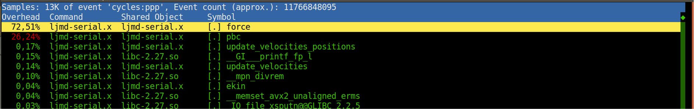
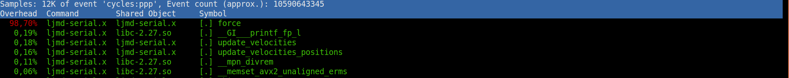
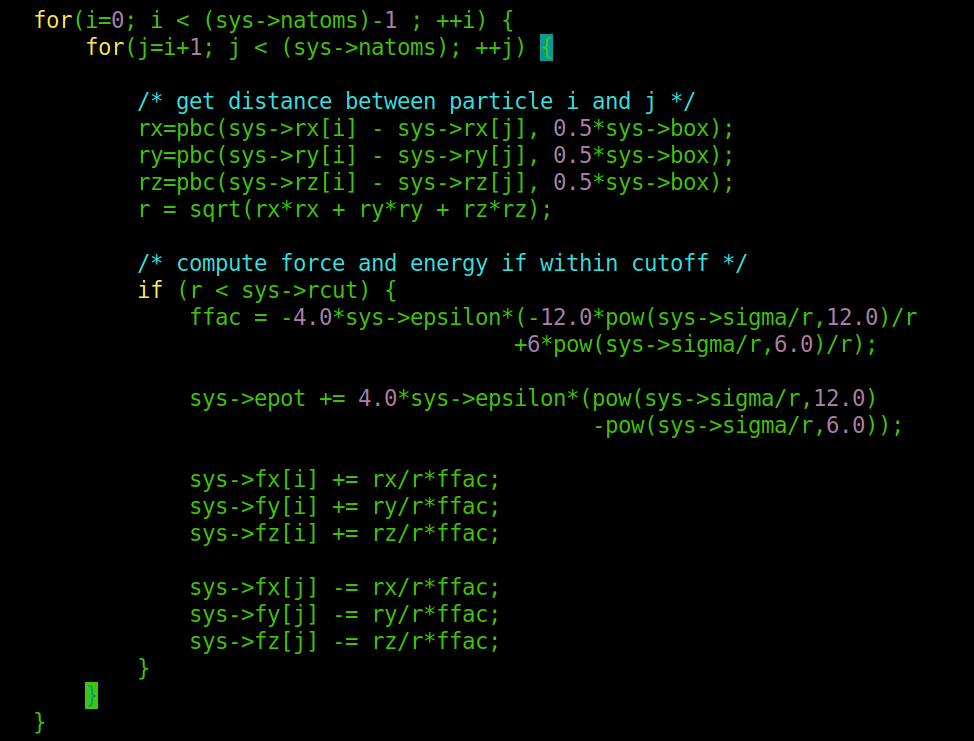
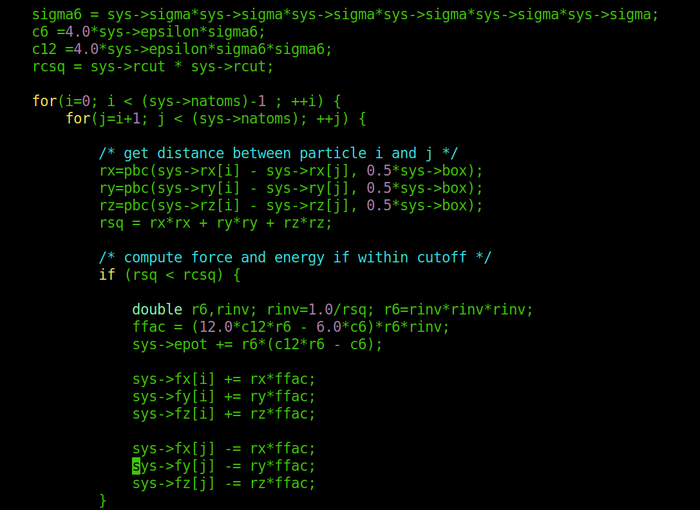

# LJMDRefactoring_group3

LJMD Refactoring, group 3

This package contains simplified MD code with multi-threading
parallelization for simulating atoms with a Lennard-Jones potential.

The bundled makefiles are set up to compile the executable once
with OpenMP disabled and once with OpenMP enabled with each build
placing the various object files in separate directories.

The examples directory contains 3 sets of example input decks
and the reference directory the corresponding outputs.

Type: make
to compile everything and: make clean
to remove all compiled objects

---

Names appearing on the commits relate to students in the following way:

*  martinateruzzi → Martina Teruzzi
*  NaimaNess → Nesrine Yousfi
*  saliei → Saeid Aliei
*  gianlucacoidessa → Gianluca Coidessa

---

### Optimization → Martina Teruzzi

We want to profile the code to understand the progresses that we are doing optimizing it. To do so, we need to know in which functions we spend the majority of the time. We use `perf` profiler to do so.
We take the code split and start profiling. In the following image we can see the results for the initial profiling:

From this Figure we evince that we spend most of the time in two functions, namely `force` and `pbc`. The code takes a total time of 3.30 seconds (measured with `/usr/bin/time`) to run on a system on 108 argon particles on my laptop. Up to this moment, the `-O3` and  `-ffast-math` flags are both present in the makefile, but the `pbc` function is not inlined. 

A count of the total time has been done also without the `-O3` optimization, and the code takes around 18 seconds (computed with `/usr/bin/time`).

We call `pbc` function many times , and the call is costly. One possibility that we have is to inline it. With this choice, we should gain almost the 25% of the calls. After inlining the function, the situation with `perf` is the following:

The `pbc` function is now inlined in `force`, and almost all the calls are made to `force` function. The time measured with `/usr/bin/time` is now 3.05 seconds.

I have added the flags `-fexpensive-optimizations -msse3`, besides the `-ffast-math` flag already present, but the total time did not change. As a benchmark, we are always using the system on 108 argon particles.

After this optimization, we start modifying actually the code. We can apply Newton 3rd law, computing just half of the loop over the couples of particles. After this modification, the loop in the force looks like the following:

After changing the loop, I compute the time for the computation of the example of 108 argon atoms is 1.45 seconds (computed with `/usr/bin/time`). As expected, we are gaining a factor of two avoiding to compute twice the couples of particles.

The next optimization we want to achieve is to avoid expensive mathematical operations like powers,  square roots and divisions. In order to do so, I change the loop of the force in the following way:

The computation of the time with `/usr/bin/time`gives 1.28 seconds.
